# Vendor Integration Platform - Frontend

## Project Overview

This project provides a frontend interface for managing vendor information and transactions. It includes several pages for different functionalities:

- **Home Page**: Overview of the project and its objectives.
- **Vendor Details Page**: Displays details of all vendors.
- **Transactions Page**: Lists all transactions.
- **Vendor-specific Page**: Shows transactions specific to a selected vendor. Admin can update transactions related to the vendor.

## Technologies Used

- **React**: Frontend framework for building user interfaces.
- **Redux**: State management library for managing application state.
- **React Router**: Navigation library for routing between different pages.
- **Axios**: HTTP client for making API requests to the backend.
- **Bootstrap**: CSS framework for styling components.

## Pages and Features

### Home Page

- Overview of the project.
- Objectives and functionalities.
- Contact information or support details.

### Vendor Details Page

- Displays a list of all vendors.
- Allows filtering and sorting of vendors.
- Links to individual vendor pages for detailed information.

### Transactions Page

- Lists all transactions across all vendors.
- Filters for date range, transaction type, or vendor.
- Pagination for navigating through transaction records.

### Vendor-specific Page

- Shows transactions specific to a selected vendor.
- Allows admin users to update transaction details for the vendor.
- Provides links back to the vendor details and transactions pages.

## Installation

Follow these steps to set up and run the project locally:

### Prerequisites

- Node.js installed on your local machine.
- Access to the backend server API (ensure it is running and accessible).

### Steps to Run the Application

1. **Clone the repository:**
   ```bash
   git clone https://github.com/Sumitkevlani/Vendor-Integration-Frontend
   cd Vendor-Integration-Frontend

2. **Install dependencies:** 
   ```bash
   npm install

3. **Start the development server**
    ```bash
    npm run dev

## Access the application

- The application will open in your default web browser at http://localhost:5173/.

```mermaid
sequenceDiagram
    participant OM as 🏢 Orders Microservice
    participant TT as 🔄 Trendyol Transform
    participant CW as 🌐 Client Wrapper
    participant TS as 🛒 Trendyol Store
    participant RM as 📦 RMS System

    Note over OM,RM: 📋 Order Processing Timeline

    %% 1. Order Fetch
    Note over OM,TS: 1️⃣ Order Fetch Process
    OM->>+TT: 📥 Fetch Orders Request
    TT->>+CW: ➡️ Forward Request
    CW->>+TS: 🔍 GET /orders (limit: 200, page: 50)
    TS-->>-CW: 📄 Order List Response
    CW-->>-TT: 📊 Order Data
    TT-->>-OM: ✨ Transformed Order Data

    %% 2. Order Status Update
    Note over OM,TS: 2️⃣ Order Status Update
    OM->>+TT: ✅ Update Order Status
    TT->>+CW: 🔄 Update Package Status
    CW->>+TS: 📝 PUT /shipment-packages/{orderCode}
    TS-->>-CW: ✅ Update Confirmation
    CW-->>-TT: 🎉 Success Response
    TT-->>-OM: ✅ Status Updated

    %% 3. Fetch Order Status
    Note over OM,TS: 3️⃣ Fetch Order Status
    OM->>+TT: 🔍 Get Order Status
    TT->>+CW: 🎯 Get Orders by IDs
    CW->>+TS: 📋 GET /orders?shipmentPackageIds={ids}
    TS-->>-CW: 📊 Order Status
    CW-->>-TT: 📄 Order Data
    TT-->>-OM: 🔄 Status Update

    %% 4. Seller Cancellation
    Note over OM,TS: 4️⃣ Seller Cancellation
    OM->>+TT: 🛑 Cancel Order Request
    TT->>+CW: ❌ Submit Cancellation
    CW->>+TS: 🚫 POST /cancel (reasonId: 501)
    TS-->>-CW: ✅ Cancellation Confirmation
    CW-->>-TT: 🎉 Success Response
    TT-->>-OM: ✅ Cancellation Confirmed

    %% 5. Create Shipment
    Note over OM,RM: 5️⃣ Create Shipment
    OM->>+TT: 📦 Create Shipment
    TT->>+RM: 💰 Generate Tax & Invoice
    RM-->>-TT: 📄 Tax & Invoice Data
    TT->>+RM: 🏷️ Generate Shipping Label
    RM-->>-TT: 📋 Label Data
    TT->>+CW: 🚚 Update Tracking Number
    CW->>+TS: 📝 PUT /shipment-packages/{code}/update-tracking
    TS-->>-CW: ✅ Tracking Updated
    CW-->>-TT: 🎉 Success Response
    TT-->>-OM: 📦 Shipment Created

    %% 6. Split Package
    Note over OM,TS: 6️⃣ Split Package
    OM->>+TT: ✂️ Split Order Request
    TT->>+CW: 📦 Split Package
    CW->>+TS: 📝 POST /shipment-packages/{code}/split
    TS-->>-CW: ✅ Split Confirmation
    CW-->>-TT: 🎉 Success Response
    TT-->>-OM: ✅ Split Completed

    %% 7. Get Shipment
    Note over OM,RM: 7️⃣ Get Shipment Details
    OM->>+TT: 📋 Get Shipment
    TT->>+RM: 💰 Get Tax Data
    RM-->>-TT: 📊 Tax Info
    TT->>+RM: 📄 Get Invoice PDF
    RM-->>-TT: 📄 Invoice Data
    TT->>+RM: 🏷️ Get Shipping Label
    RM-->>-TT: 📋 Label Data
    TT-->>-OM: 📦 Complete Shipment Data

    %% Styling
    %%{init: {'theme':'base', 'themeVariables': {
      'primaryColor': '#b06565',
      'primaryTextColor': '#fff',
      'primaryBorderColor': '#905959',
      'lineColor': '#5f27cd',
      'secondaryColor': '#f9e79f',
      'tertiaryColor': '#ff9ff3'
    }}}%%
```



